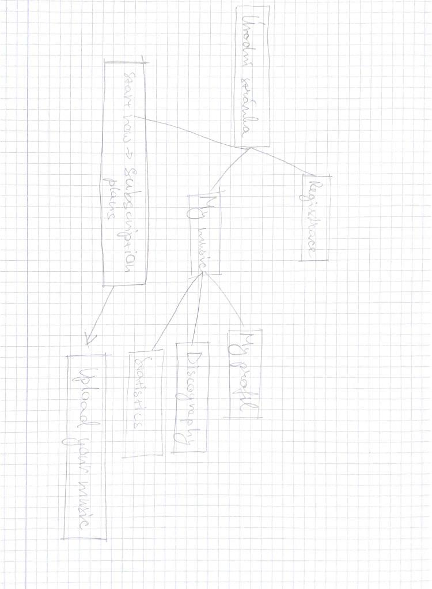
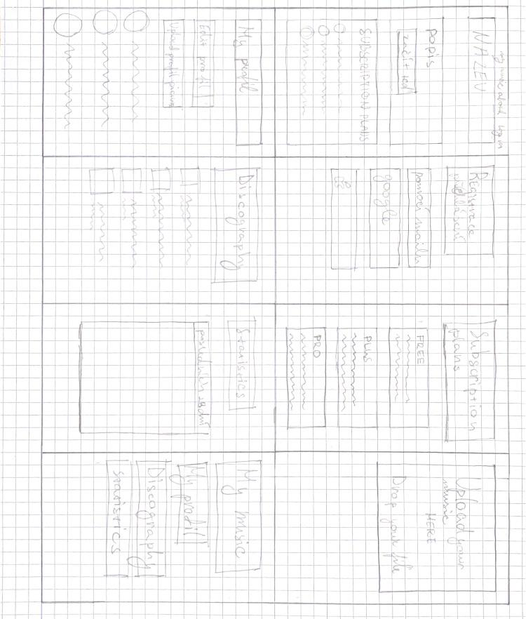

# MusicWithYou

MusicWithYou je webová aplikace vytvořená pomocí Django frameworku, která funguje jako hudební streamovací platforma. Uživatelé si zde budou moci vytvořit účet a nahrávat vlastní hudební skladby. Při nahrávání skladby bude možné vyplnit název, popis, vybrat žánr a přidat vlastní cover obrázek.

Každá skladba bude uložena v databázi společně s informacemi o autorovi, datu nahrání a počtu přehrání. Uživatelé budou moci přehrávat nejen svou hudbu, ale i skladby ostatních autorů. Součástí projektu bude také sledování statistik poslechnutí, aby autoři viděli, kolikrát byla jejich skladba přehrána.

Cílem projektu je vytvořit moderní databázovou webovou aplikaci zaměřenou na sdílení a streamování hudby, bude fungovat podobně jako služba Soundcloud.

# Odporný článek

Projekt MusicWithYou je webová a mobilní aplikace určená pro sdílení hudby mezi hudebními producenty a posluchači. Hlavním cílem aplikace je umožnit uživatelům jednoduše nahrávat vlastní hudbu, poslouchat skladby ostatních a zároveň sledovat statistiky poslechů a výdělky z přehrávání.

Základním prvkem systému je uživatel. V aplikaci existují tři hlavní role: anonymní návštěvník, registrovaný uživatel a administrátor. Anonymní návštěvník může procházet katalog skladeb, zobrazovat informace o hudbě a poslouchat dostupné skladby. Registrovaný uživatel má navíc možnost nahrávat vlastní hudbu, sledovat své statistiky a spravovat svůj profil. Administrátor má právo spravovat obsah aplikace, kontrolovat nahrané skladby a řešit případné porušení pravidel.

Každý uživatel může nahrávat skladby prostřednictvím jednoduchého rozhraní typu „drop your file here“, kde přetáhne hudební soubor do nahrávacího pole. Ke každé skladbě jsou uložena data jako název skladby, autor, datum nahrání, počet přehrání a případně žánr. Systém také eviduje statistiky poslechů, které zobrazují počet přehrání jednotlivých skladeb.

Součástí aplikace je také systém monetizace. Každé přehrání skladby generuje malý finanční příjem, který se zapisuje do balance účtu autora. Hodnota jednoho přehrání je nastavena na 0,003 Kč. Uživatel tak může sledovat svůj celkový výdělek a počet poslechů ve statistickém přehledu.

Aplikace nabízí také několik typů subscription plánů. Uživatel si může vybrat mezi plány Free, Plus a Pro. Každý plán poskytuje různé funkce, například větší počet nahraných skladeb, detailnější statistiky nebo další výhody pro tvůrce obsahu.

Databázová struktura aplikace tak zahrnuje entity jako uživatel, skladba, statistiky, subscription plán, balance účet a přehrání. Tyto entity spolu vzájemně souvisejí a vytvářejí komplexní systém pro správu hudebního obsahu a jeho monetizaci.
## Application Structure

## Page Wireframes

